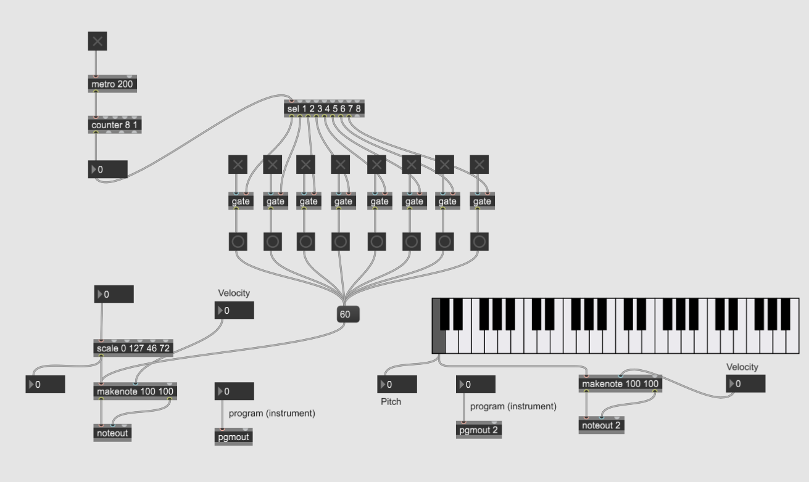
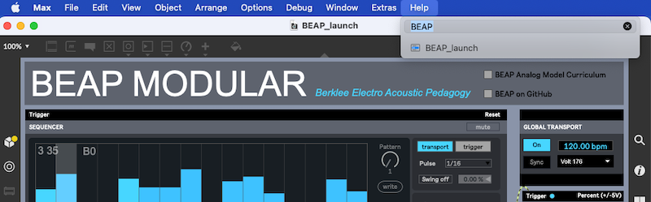
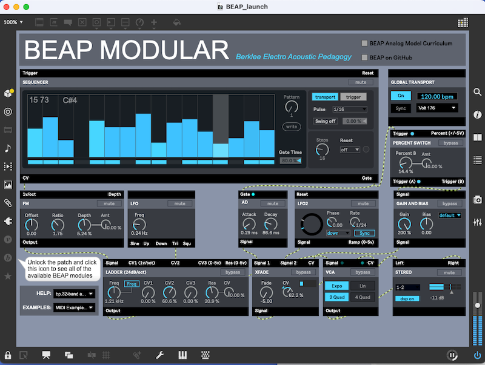
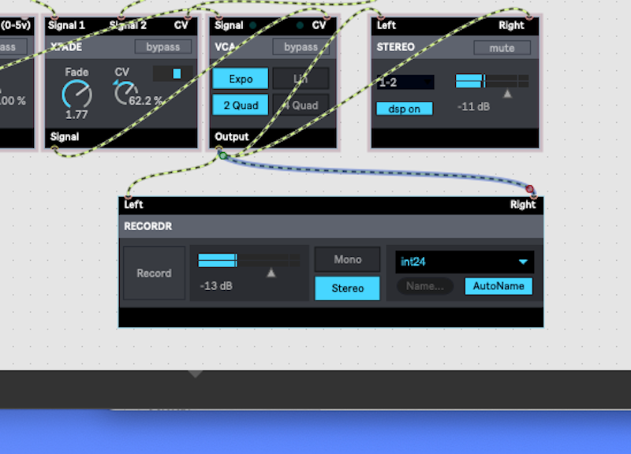
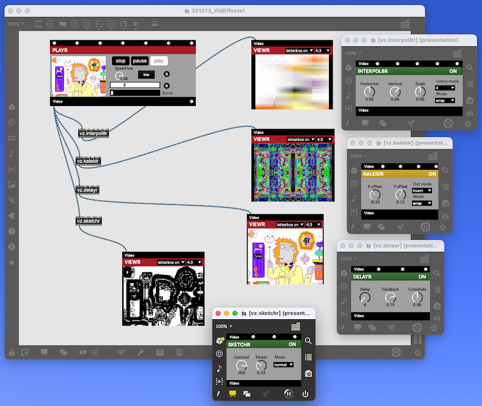

# Playing and Creating With MAX 8

This session gives you the chance to dive deeper into MAX and create your own small artefacts that you can later share with others. So do not forget to record your final product, audio or video, with the respective Output modules from BEAP or Vizzie. There are also other tools available on the computer if you prefer.

## 2 Channel MIDI Patch
The patch ```221213_SeqSimpleAndKeyboard``` combines a simple sequencer with a MIDI keyboard. Each instrument is running over a different MIDI Channel, so you can choose different instruments (MIDI term: programs) for each. Furthermore, you can adjust the velocity separately.




## A Random Blinking Matrix - Jitter Video
This sketch uses Jitter, the underlying objects running Vizzie. 

For each video, Jitter creates a matrix with four planes, each the size of the display. The planes are overlayed and add up to get a visible image. One plane represents the intensity [0/0.0 -> dark, 255/1.0 -> bright] the other three the basic colours (RGB, short for **R**ed, **G**reen, **B**lue). You can find more about this [here](https://docs.cycling74.com/max8/tutorials/jitterchapter00a_whatisamatrix).

After extracting the file ```221213 MAX Jitter Matrix2.maxpat```, open the file, save it under an new name and then play with the parameters. ```jit.matrix 4 char 320 240 @interp 0 @thro 0``` allows you to change the size of the displaymatrix (320 x 240), whether you want to have colour (4) or black and white (1) by defining the number of planes. You may also change the value following ```@interp``` to 1 and see what happens. 

The object ```jit.noise 4 char 8 8``` sets also 4 planes defines the number of rectangles for the display (4 x 4) and generates random numbers in the range from 0 to 255 (char) that create the changing colours. 

By pressing the ```ESC``` you can get a fullscreen window of your matrix, the buttons and toggle switches allow you to control the frequency of the changes or do the changes manually.


## More about BEAP
BEAP is the modularized audio processing platform. You can use it for sequencing, synthezising and many other applications. A good starting point is the ready-made syntheziser you can access by typing ```BEAP``` into the ```Help``` menu.



This patch invites you to play around with the various settings, by clicking on ```BEAP Analog Model Curriculum``` you get access to a website that explains the basics of sound synthesis with BEAP. The ```Help``` and ```Example``` sections, accessible at the left bottom of the patch, give you easy access to many different patches.



You can also record inside of BEAP. Just open the BEAP menu at the left side of the MAX window, go to Output and select the RecordR module. Then patch it the last Output outlets before the Stereo module. 




## More Visual Effects with Vizzie

Vizzie offers many effects that allow you to manipulate your video content. The patch ```221213_VidEffects1.maxpat``` has four effects, Interpolation, Kaleidoscop, Delay and Sketch. When double-clicking on the object, the user interface for the respective object opens in a new window. You can achieve very interesting effects while changing the parameters. A good starting point to understand what is happening is to find settings that do not alter the video content. But this is not achievable for all four effects here ... .



There are more effects available. Create a new object with entering ```n```, then type ```vz. ```. You will see more options. Create a new object, then call the help function to get more information on how to use the effect. Try it out!

You can also concatenate effects (applying one effect after another) using the PATCHROUTR module. Have a look again at [last session's explanation](https://github.com/mibrs/GPC5L09/blob/main/README.md) on how to use the module.


## Sharing Videos With Your Blog
When using GitHub Pages to run your blog you need to know that you cannot upload files that are bigger than 25MB. While this is no real limit for images, videos are quickly bigger than that limit.

The easiest way to still publish your video is to save it on your Google Drive and then provide a link for your blog.


Once you have saved your video on your Google Drive, create a link by opening the context menu of your video in Google Drive, and then click on ```Copy Link```. Next, paste your link onto your website into a link tag. Check out how to do this with 

- [HTML](https://www.w3schools.com/html/html_links.asp) or 
- [Markdown](https://gist.github.com/sandrabosk/d79bd806c8b1b13ad9af1e590a26deb5).

Your video will then be accessible like this example [link](https://drive.google.com/file/d/1W1AuV_wfASNAwVq1FYt0-5pXnlcyo7yS/view?usp=sharing).


